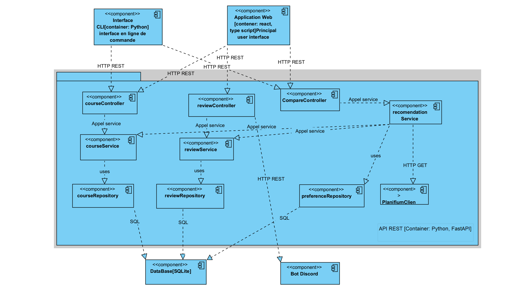

# Architecture du système

## Vue d'ensemble

**Architecture retenue** : Application monolithique modulaire avec API REST

**Description** :
L'architecture adoptée est une application centralisée avec séparation claire des responsabilités, organisée autour d'une API REST qui sert les différentes interfaces (web, CLI). Cette approche simplifiée répond aux exigences du projet tout en garantissant la maintenabilité.

**Raisons du choix** :

1. **Simplicité** : Adéquate pour la portée du projet étudiant
2. **Maintenabilité** : Codebase unique plus facile à gérer en petite équipe
3. **Déploiement** : Infrastructure plus simple à mettre en œuvre
4. **Performance** : Réduction de la latence inter-services
5. **Alignement avec les exigences** : Correspond au mandat de phase 2

## Composants principaux

### Application Backend

**API REST Principale** (`backend-api`)

- Point d'entrée unique pour toutes les fonctionnalités
- Gestion des requêtes HTTP et routage
- Validation des données d'entrée
- Agrégation des réponses

**Module Authentification** (`auth-module`)

- Gestion des sessions utilisateur
- Vérification des accès basique
- Pas de système de comptes complexe (conforme aux exigences)

**Module Cours** (`courses-module`)

- Intégration avec l'API Planifium
- Gestion du catalogue de cours et horaires
- Vérification des préalables et corequis
- Calcul de l'éligibilité des étudiants

**Module Avis** (`reviews-module`)

- Collecte des avis via le bot Discord
- Agrégation et calcul des métriques (charge travail, difficulté)
- Application du seuil minimal (n ≥ 5 avis)
- Gestion des filtres (session, charge, difficulté)

**Module Profil** (`profile-module`)

- Gestion des préférences étudiantes (théorie/pratique, centres intérêt)
- Personnalisation de l'affichage
- Sauvegarde des configurations utilisateur

### Interfaces Utilisateur

**Application Web** (`web-interface`)

- Interface principale pour les utilisateurs
- Affichage responsive des tableaux de bord
- Fonctionnalités de recherche et comparaison
- Personnalisation selon le profil

**Interface Ligne de Commande** (`cli-interface`)

- Interface alternative minimaliste
- Accès aux fonctionnalités principales
- Formatage texte pour résultats rapides

**Bot Discord** (`discord-bot`)

- Collecte des avis étudiants
- Formatage et envoi vers l'API principale
- Interface conversationnelle simple

### Stockage des Données

**Base de données SQLite** (`main-database`)

- Stockage des avis étudiants et préférences
- Cache des données Planifium
- Métadonnées d'application
- Données de session utilisateur

**Fichiers de Configuration** (`config-files`)

- Paramètres d'intégration API Planifium
- Configuration du bot Discord
- Préférences système

## Intégrations externes

### API Planifium

**Rôle** : Source principale des données officielles de cours
**Données échangées** :

- Catalogue des cours (codes, titres, crédits)
- Horaire des sessions
- Préalables et corequis
- Informations des programmes

**Fréquence** : Synchronisation quotidienne + cache local

### Plateforme Discord

**Rôle** : Canal de collecte des avis étudiants
**Données échangées** :

- Évaluations de cours (charge travail, difficulté)
- Commentaires optionnels
- Métadonnées (session, année)

**Format** : Messages structurés via bot dédié

## Flux de données

### Consultation des cours

Utilisateur → API REST → [Cache local] → Planifium → Affichage

### Collecte des avis

Discord → Bot → API REST → Base données → Agrégation → Affichage conditionnel

### Personnalisation

Étudiant → Interface → Profil → Sauvegarde → Application préférences

## Diagrammes d'architecture

### Niveau 1 - Diagramme de Contexte

### Niveau 2 - Diagramme de Conteneurs

### Niveau 3 - Diagramme de Composants

