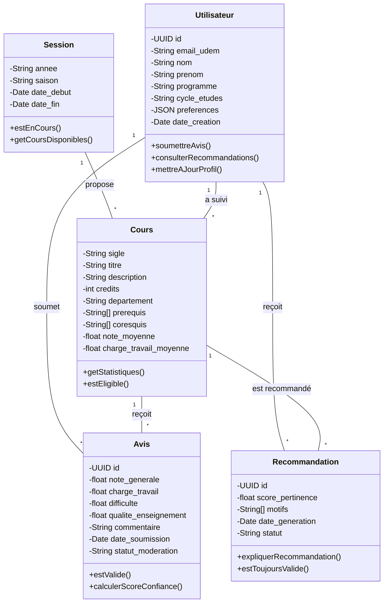

# Diagrammes UML

## Diagrammes de classes

### Modèle de données orienté objet

```mermaid
classDiagram
    class Utilisateur {
        -UUID id
        -String email_udem
        -String nom
        -String prenom
        -String programme
        -String cycle_etudes
        -JSON preferences
        -Date date_creation
        +soumettreAvis()
        +consulterRecommandations()
        +mettreAJourProfil()
    }

    class Cours {
        -String sigle
        -String titre
        -String description
        -int credits
        -String departement
        -String[] prerequis
        -String[] coresquis
        -float note_moyenne
        -float charge_travail_moyenne
        +getStatistiques()
        +estEligible()
    }

    class Avis {
        -UUID id
        -float note_generale
        -float charge_travail
        -float difficulte
        -float qualite_enseignement
        -String commentaire
        -Date date_soumission
        -String statut_moderation
        +estValide()
        +calculerScoreConfiance()
    }

    class Recommandation {
        -UUID id
        -float score_pertinence
        -String[] motifs
        -Date date_generation
        -String statut
        +expliquerRecommandation()
        +estToujoursValide()
    }

    class Session {
        -String annee
        -String saison
        -Date date_debut
        -Date date_fin
        +estEnCours()
        +getCoursDisponibles()
    }

    Utilisateur "1" -- "*" Avis : soumet
    Cours "1" -- "*" Avis : reçoit
    Utilisateur "1" -- "*" Recommandation : reçoit
    Cours "1" -- "*" Recommandation : est recommandé
    Session "1" -- "*" Cours : propose
    Utilisateur "1" -- "*" Cours : a suivi

```

