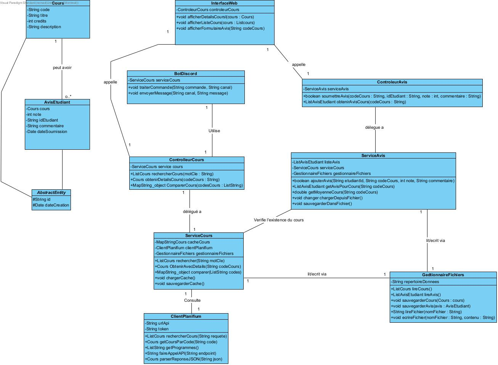
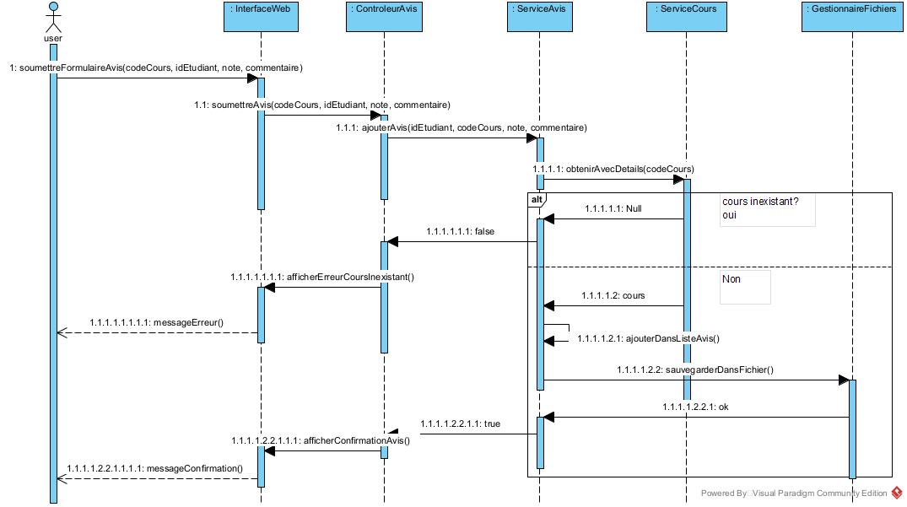
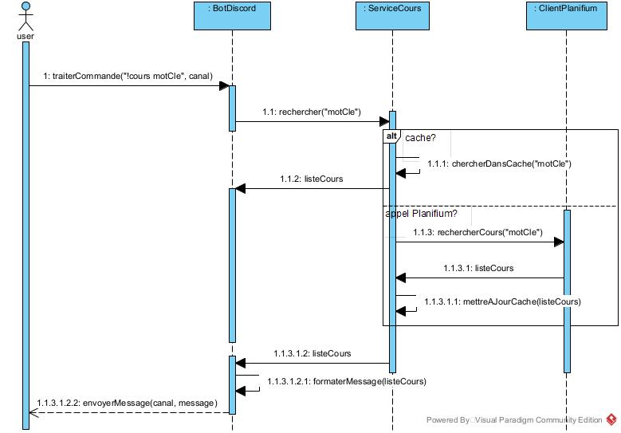
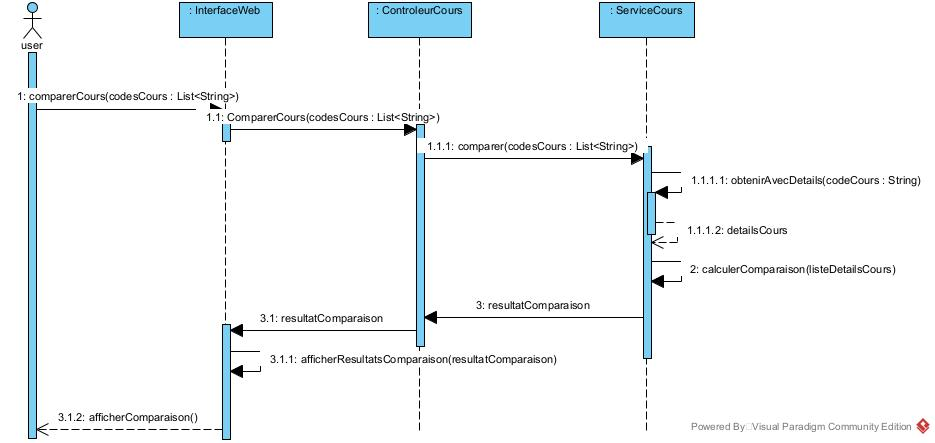

# Diagrammes UML

## Diagrammes de classes

### Modèle de données orienté objet

    
    %% ===========================================
    %% CLASSES DU DOMAINE 
    %% ===========================================
    class AbstractEntity {
        <<abstract>>
        #String id
        #Date dateCreation
    }
    
    class Cours {
        -String code
        -String titre
        -int credits
        -String description
    }
    
    class AvisEtudiant {
        -String idEtudiant
        -Cours cours
        -int note
        -String commentaire
        -Date dateSoumission
    }
    
    Cours --|> AbstractEntity
    AvisEtudiant --|> AbstractEntity
    
    Cours "1" --> "0..*" AvisEtudiant : "a pour"
    
    %% ===========================================
    %% INTERFACES UTILISATEUR 
    %% ===========================================
    class InterfaceWeb {
        -ControleurCours controleurCours
        +void afficherListeCours(cours : List~Cours~)
        +void afficherDetailsCours(cours : Cours)
        +void afficherFormulaireAvis(codeCours : String)
    }
    
    class BotDiscord {
        -ControleurCours controleurCours
        +void traiterCommande(commande : String, canal : String)
        +void envoyerMessage(canal : String, message : String)
    }
    
    %% ===========================================
    %% CONTRÔLEURS (classes concrètes)
    %% ===========================================
    class ControleurCours {
        -ServiceCours serviceCours
        +List~Cours~ rechercherCours(motCle : String)
        +Cours obtenirDetailsCours(codeCours : String)
        +Map~String, Object~ comparerCours(codesCours : List~String~)
    }
    
    class ControleurAvis {
        -ServiceAvis serviceAvis
        +boolean soumettreAvis(codeCours : String, idEtudiant : String, note : int, commentaire : String)
        +List~AvisEtudiant~ obtenirAvisCours(codeCours : String)
    }
    
    %% ===========================================
    %% SERVICES (avec cache intégré )
    %% ===========================================
    class ServiceCours {
        -Map~String, Cours~ cacheCours
        -ClientPlanifium clientPlanifium
        -GestionnaireFichiers gestionnaireFichiers
        +List~Cours~ rechercher(motCle : String)
        +Cours obtenirAvecDetails(codeCours : String)
        +Map~String, Object~ comparer(codes : List~String~)
        -void chargerCache()
        -void sauvegarderCache()
    }
    
    class ServiceAvis {
        -List~AvisEtudiant~ listeAvis
        -ServiceCours serviceCours
        -GestionnaireFichiers gestionnaireFichiers
        +boolean ajouterAvis(idEtudiant : String, codeCours : String, note : int, commentaire : String)
        +List~AvisEtudiant~ obtenirPourCours(codeCours : String)
        +double calculerMoyenneCours(codeCours : String)
        -void chargerDepuisFichier()
        -void sauvegarderDansFichier()
    }
    
    %% ===========================================
    %% CLASSES UTILITAIRES
    %% ===========================================
    class GestionnaireFichiers {
        -String repertoireDonnees
        +List~Cours~ lireCours()
        +List~AvisEtudiant~ lireAvis()
        +void sauvegarderCours(cours : Cours)
        +void sauvegarderAvis(avis : AvisEtudiant)
        -String lireFichier(nomFichier : String)
        -void ecrireFichier(nomFichier : String, contenu : String)
    }
    
    class ClientPlanifium {
        -String urlApi
        -String token
        -HttpClient httpClient
        +Cours recupererCours(codeCours : String)
        +List~Cours~ rechercherCours(requete : String)
        +List~String~ obtenirProgrammes()
        -String faireRequeteHTTP(endpoint : String)
        -Cours parserReponseJSON(json : String)
    }
    
    %% ===========================================
    %% RELATIONS
    %% ===========================================
    InterfaceWeb "1" --> "1" ControleurCours : "appelle"
    InterfaceWeb "1" --> "1" ControleurAvis : "appelle"
    BotDiscord "1" --> "1" ControleurCours : "utilise"
    
    ControleurCours "1" --> "1" ServiceCours : "délègue à"
    ControleurAvis "1" --> "1" ServiceAvis : "délègue à"
    
    ServiceCours "1" --> "1" ClientPlanifium : "consulte"
    ServiceCours "1" --> "1" GestionnaireFichiers : "lit/écrit via"
    ServiceAvis "1" --> "1" ServiceCours : "vérifie existence via"
    ServiceAvis "1" --> "1" GestionnaireFichiers : "lit/écrit via"

 **Diagrammes de séquence**

